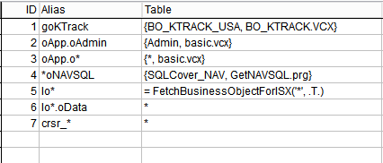
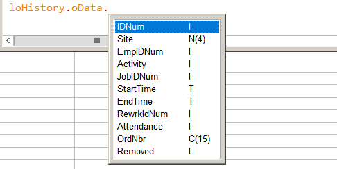

# Thor News

**IntellisenseX: New Thor Tools and Hidden Gems** 
---

### #47, 2023-01-27

#### New Thor Tools
The list of Thor tools that use the IntellisenseX dropdown listbox has been greatly expanded. Like all Thor tools, you can make them accessible by assigning a hot key, adding them to a pop-up menu, or any of the other options that Thor provides for executing a tool.

| Thor Tool | Description |
| --- | ----------- |
| Dropdown Procedures List | List of all PRGs and procedures/functions defined in PRGs found in "Set Procedure to"|
| Dropdown Constants List | List of all defined constants created by #Define or #Include statements |
| Dropdown Table Names | List of all tables in the path|
| Dropdown Intellisense scripts | List of native Intellisense custom scripts|
| AutoComplete | List of all names used in code window (or what is highlighted there)|
| Dropdown Form Names in Active Project | List of all form names in the Active Project|
| Dropdown Report Names in Active Project | List of all report names in the Active Project|
| Dropdown Aliases | List of all aliases used in current data session
| DBC Tables by !| Assigns hot key ! so that typing in the name of a database followed by ! gives a popup of the names of the tables and views in the database.|

#### Hidden Gems ####
Thor tool **Browse Alias Dictionary** provides some very powerful and almost universally overlooked features for getting dropdowns of business objects and data objects.  IntellisenseX provides many features for getting dropdown lists of what are essentially local objects; this is documented elsewhere and available simply by using IntellisenseX.  The Alias Dictionary extends that by recognizing objects that are more "universal" throughout an application.

Here's an example of the Alias Dictionary that we'll use to demonstrate some of the power that is available.

##### Business Object Examples

* Example #1 is that of an object that is referenced globally in code.  Here's the definition in the table for one such object named goKTrack:

The field _Table_ above contains the definition of the class for goKTrack. The curly braces indicate a class definition where the name of the class and the class library are separated by a comma. _(Note: to obtain the contents of the dropdown, the class is instantiated using NewObject, but the Init does not fire.)_ 

* Example #2 is much like #1, except that the Alias is actually a compound name (i.e., with dots):

* Example #3 is a generalized version of #2, using wildcards in both the _Alias_ and the the _Table_ fields. The wildcard in the _Table_ field is replaced with whatever matches the wildcard in the _Alias_ field.  Thus, this would cover example #2 as well as handling similar objects like _oApp.oUser_ and any other objects contained in _oApp_.

* Example #4 handles a different issue, where an object can be referenced with different (yet very similar) names.

    - `ThisForm.oNAVSQL`
    - `This.oNAVSQL`
    - `loNAVSQL`
    - `toNAVSQL`

* Example #5 is a variant of #3.  In this case, the wildcard is interpreted as a table name and passed to a UDF that returns the business object for that table.  _(Note: The class should be instantiated using NewObject with a third parameter of 0 so that the Init does not fire.)_ 

 

In this case, the _Table_ field contains an executable expression, indicated by the leading 
'='.

 

##### Other Examples

* Example #6 is a continuation of #5, where the business object contains a data object.  

 

In this case, the _Table_ field contains just the wildcard (assumed to be the file name)

 

* Example #7 handles the case where you have a cursor selected from a table and the cursor name contains the name of the source table.

 

  

#### Updates and corrections

* New:
    * New keystrokes:
        * **Ctrl+Enter** is a special case that applies when the dropdown list is a list of properties and methods.  The second column in the dropdown gives the parameter list, if available.  This keystroke selects the current item from the dropdown and pastes the parameter list into edit window as well.
        * **Ctrl+C** copies the contents of the second visible column into the clipboard.
        * **Ctrl+Z** closes the popup and leaves the text already entered as is, whether it matches anything in the dropdown or not.
    * Dropdown box is resizable.
        
* Fixed:
    * Previously, pressing a dot to cause the dropdown would cause garbage results when the character immediately following is a valid name character.  (This would occur, for instance, if entering a table name and dot before an existing field reference.) The dot is now ignored.
    * When using the dropdown box for other uses (defined constants, procedures, etc), clicking anywhere in the name before invoking the dropdown moves the cursor to the end of the name and works normally.
    * Dropdown box now uses the option for maximum number of items to display.
    * Dropdown box shrinks to fit in the VFP screen if necessary.

##### Interconnection with GoToDefinition

It has only been very recently explicitly recognized that there is a very close logical connection between IntellisenseX and GoToDefinition, namely that if IntellisenseX can provide a dropdown list for an object, then GoToDefinition should also be able to work on that object.

Thus, you will find, in a soon to be released update to GoToDefinition (Feb. 2023),
in all of the cases documented here and all other uses of IntellisenseX, if you can use IntellisenseX on an object, you can also use GoToDefinition on that object.

This new update to GoToDefinition will take this one step further, related to methods of these objects. Using GoToDefinition on the method will go to that object and the indicated method.

  

Will modify the class for _goTrack_ and open method _AddCursorToResult_

---
See also [Thor News](../Thor_news.md) and the [Thor Forum](https://groups.google.com/forum/?fromgroups#!forum/FoxProThor).  

---
See also [Thor News](../Thor_news.md) and the [Thor Forum](https://groups.google.com/forum/?fromgroups#!forum/FoxProThor).  

---

See also
* [Thor Forum](http://groups.google.com/group/FoxProThor)

* [Thor Videos](Thor_videos.md)

---

Headlines History
---

**[2023-01-27 : IntelliSenseX Enhancements ](NewsItems/Item_47.md)** 

**[2023-01-20 : Two New Thor Tools: "Execute Selected Text" and "Highlight Current Statement" ](NewsItems/Item_46.md)** 

**[2023-01-13 : Class Browser Enhancements](NewsItems/Item_45.md)** 

**[2023-01-06 : FoxTabs Enhancements](NewsItems/Item_44.md)** 

**[2022-12-26 : Object Explorer Enhancements](NewsItems/Item_43.md)** 

**[2015-11-30 : New Thor Tools and SuperBrowse Enhancements](NewsItems/Item_42.md)**

**[2015-01-12 : New VFPX Projects - ThemedTitleBar and VFP 9 SP2 Hotfix 3 Download](NewsItems/Item_41.md)**

**[2014-01-04 : Go To Definition](NewsItems/Tweet_27.md)**

**[2014-12-22 : Three New Thor Tools](NewsItems/Tweet_26.md)**

**[2014-12-17 : New VFPX Projects - VFP Runtime Installers and StripeX](NewsItems/Item_38.md)**

**[2014-11-30 : Five New Thor Tools for FoxBin2PRG](NewsItems/Tweet_25.md)**

**[2014-11-25 : Nine New Thor Tools](NewsItems/Tweet_24.md)**

**[2014-11-17 : Buffer Overrun Detected!](NewsItems/Tweet_23.md)**

**[2014-06-11 : Related IntellisenseX Tools](NewsItems/Tweet_22.md)**

**[2014-06-04 : Advanced Features: Plug-Ins for IntellisenseX](NewsItems/Tweet_21.md)**

**[2014-05-29 : Quick Start Guide to IntellisenseX](NewsItems/Tweet_20.md)**

**[2014-05-21 : Deficiencies in IntellisenseX (and how to avoid them) … The Custom Keyword List](NewsItems/Tweet_19.md)**

**[2014-05-10 : IntellisenseX for Nested Objects](NewsItems/Tweet_18.md)**

**[2014-04-29 : Using Local Aliases in IntellisenseX](NewsItems/Tweet_17.md)**

**[2014-03-03 : Custom Keyword List for Field Names](NewsItems/Tweet_16.md)**

**[2014-02-24 : IntellisenseX and the Alias Dictionary](NewsItems/Tweet_15.md)**

**[2014-02-17 : IntellisenseX for Objects](NewsItems/Tweet_14.md)**

**[2014-02-10 : New (hidden) IntellisenseX Feature](NewsItems/Tweet_13.md)**

**[2014-02-03 : IntellisenseX by Dot or by Hot Key?](NewsItems/Tweet_12.md)**

**[2014-01-27 : IntellisenseX: Aliases for VFP Tables](NewsItems/Tweet_11.md)**

**[2014-01-20 : IntellisenseX: Field Names from SQL Server Tables](NewsItems/Tweet_10.md)**

**[2014-01-13 : Extract to Variable and Extract to Constant](NewsItems/Tweet_09.md)**

**[2014-01-05 : Creating Properties and Methods (#3)](NewsItems/Tweet_08.md)**

**[2013-12-18 : Creating Properties and Methods (#2)](NewsItems/Tweet_07.md)**

**[2013-08-26 :  Thor Version 1.40 released: Thor ToolBar](NewsItems/Item_18.md)**

**[2013-06-23 :  New VFPX Project: Finder](NewsItems/Item_17.md)**

**[2012-01-16 :  Thor videos available from Thor menu](NewsItems/Item_14.md)**

**[2012-01-05 :  Thor's Tool Launcher: The one tool you must use](NewsItems/Item_13.md)**

**[2012-11-16 :  Thor menus provide access to Discussion Forums and Change Logs](NewsItems/Item_12.md)**

**[2012-10-14 :  New VFPX Project: FoxcodePlus](NewsItems/Item_10.md)**

**[2012-10-06 :  Easy access to all VFPX home pages](NewsItems/Item_9.md)**

**[2012-09-30 :  New VFPX project: IntellisenseX](NewsItems/Item_8.md)**

**[2012-09-19 :  All VFPX projects can be downloaded from Thor](NewsItems/Item_7.md)**

**[2012-09-16 :  Use the Thor discussion group](NewsItems/Item_6.md)**

**[2012-09-10 :  IntellisenseX released](NewsItems/Item_5.md)**

**[2012-09-09 :  Data Explorer is now a Thor tool](NewsItems/Item_4.md)**

**[2012-09-04 :  New VFPX Projects: Dynamic Forms & Data Explorer](NewsItems/Item_3.md)**

**[2012-08-25 : Introducing Thor News](NewsItems/Item_1.md)**

---

Last changed: _2023-01-13_ 

